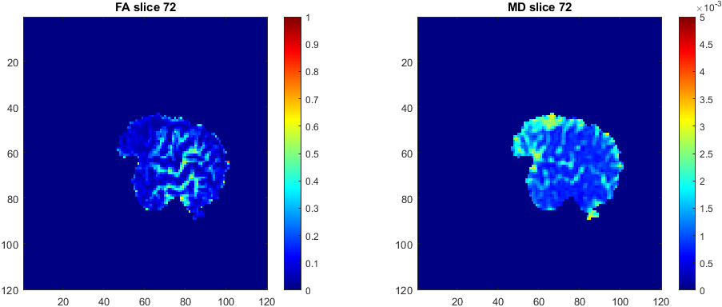

# DMRI/fMRI Integration

Given resting state functional MRI and diffusion MRI data from an healthy
subject, the aim of the homework is to investigate their relationship. 

In order to do so, the following tasks have
been implemented:
- pre-processing on fMRI data;
- Functional Connectivity (FC) matrix computation and graph measures derivation;
- fit of the diffusion tensor;
- DTI metrics computation: Fractional Anisotropy (FA) and Mean Diffusivity (MD);
- comparison between DTI parameters and connectivity measures.
This report and its related code are divided into 3 main sections: § 1 for the func-
tional MRI (fMRI) analysis, § 2 for the diffusion MRI analysis and § 3 for DMRI/fMRI
integration.

**Due to privacy reasons, NO DATA about the patients is shared.**

>
>*Slice 62 - Horizontal Section. On top: original GM, WM and CSF maps; on the
bottom the final masks: threshold and erosion applied on GM, WM and CSF maps.*

>
>*On the left the regression matrix and on the right the regression matrix with the
regressors converted to z-scores.*

>
>*From the top: node degree, node strength and node betweenness. In red the top 10
nodes for each category.*

>
>*Diffusion signal of the voxel [81, 82, 50] populated with cerebrospinal fluid:
unsorted by its b-value on top, sorted in the bottom.*

>
>*Sagittal Section - Visualization of the CVs maps for the slice #72: on the top the FA
and on the bottom the MD for the two approaches.*

>
>* Sagittal Section - Plot of the FA (left) and MD (right) maps for the slice #72.*

 For the paper, the license used is: <a rel="license" href="http://creativecommons.org/licenses/by-nc-sa/4.0/">Creative Commons Attribution-NonCommercial-ShareAlike 4.0 International License</a>.

